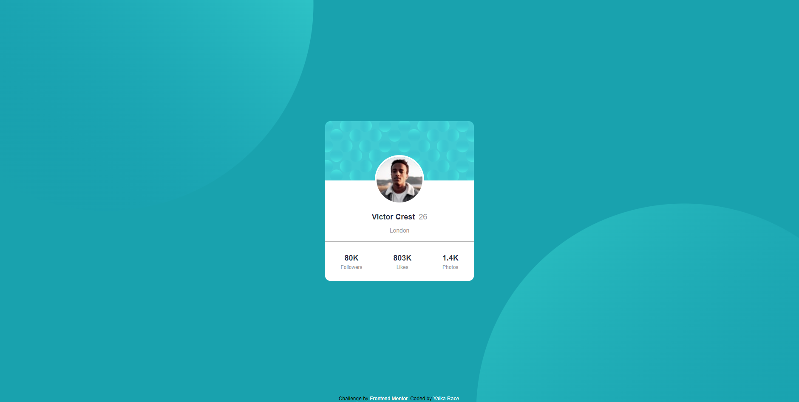

# Frontend Mentor - Profile card component solution

This is a solution to the [Profile card component challenge on Frontend Mentor](https://www.frontendmentor.io/challenges/profile-card-component-cfArpWshJ). Frontend Mentor challenges help you improve your coding skills by building realistic projects. 

## Table of contents

- [Overview](#overview)
  - [The challenge](#the-challenge)
  - [Screenshots](#screenshots)
  - [Links](#links)
- [My process](#my-process)
  - [Built with](#built-with)
  - [What I learned](#what-i-learned)
  - [Continued development](#continued-development)
- [Author](#author)

## Overview

### The challenge

- Build out the project to the designs provided

### Screenshots

#### Desktop View

#### Mobile View

### Links

- Live Site URL: [Click Here](https://profile-card-component-yaikarace.vercel.app/)

## My process

### Built with

- Semantic HTML5 markup
- CSS custom properties
- Flexbox
- [Tailwind CSS](https://tailwindcss.com)

### What I learned
I learned how to install and use Tailwind CSS in a project.

### Continued development
I will continue to learn more about Tailwind CSS and also learn about other frameworks to improve my CSS development and productivity.

## Author

- Frontend Mentor - [@YaikaRace](https://www.frontendmentor.io/profile/yaikarace)
- GitHub - [YaikaRace](https://github.com/yaikarace)
- YouTube Channel - [Yaika Race](https://youtube.com/c/yaikarace)
